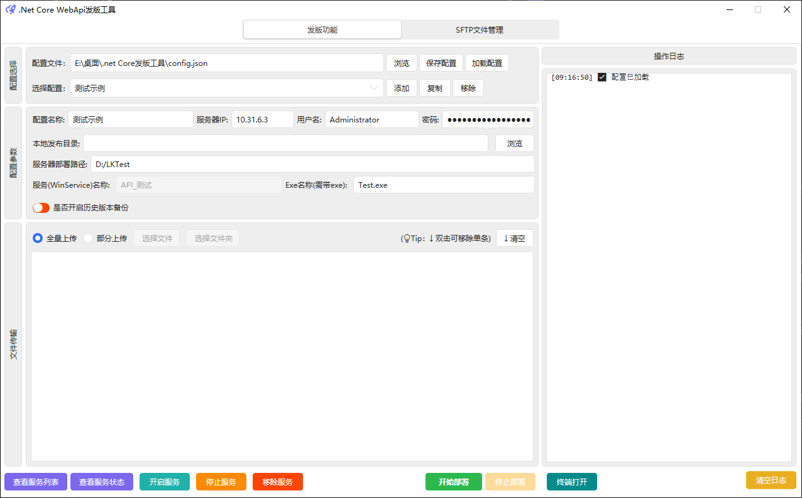
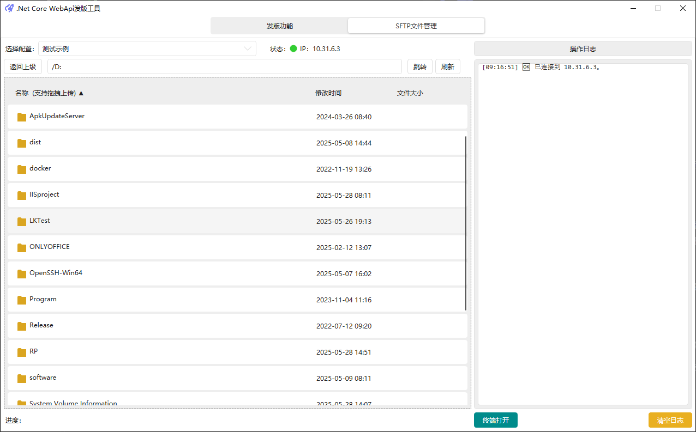

.Net Core PublishTool
### 项目截图

### 项目说明

#### 一、项目技术栈和工具包:

- WPF(.Net Core 3.1)(项目框架)
- HandyControl(UI组件)
- SSH.Net(核心依赖包)

#### 二、适用场景：

适用于将.net Core 之后版本的Asp.net项目发布到Windows系统的远程服务器上。

#### 三、远程服务器需要安装设置以下软件：
- .Net Core Runtime 运行环境
- OpenSSH-For-Windows：用于远程连接服务器,开启SFTP服务,并将其添加到环境变量中,并设置自动运行
- NSSM.exe：用于管理Windows服务,且需要将其添加到环境变量中

#### 四、核心原理：
通过ssh链接远程服务器,通过sftp将本地publish的包上传到远程服务器,然后通过nssm将远程服务器上的Asp.net项目注册成Windows服务,并自动启动。
#### 五、开发版功能使用步骤：
1. 运行PublishTool.exe，载入配置文件(config.json), 选择某项配置。
2. 如果没有配置项， 可点击选择配置后的`添加`按钮，输入配置名， 并填好相关配置信息，主要包括：
    - 远程服务器IP地址(必)
    - 远程服务器ssh用户名(必)
    - 远程服务器ssh密码(必)
    - 远程服务器Asp.net项目路径(必)
    - 本地publish的包路径(必)
    - 需要运行的exe文件名(必)
    - 是否开启备份功能(选)

    点击`保存配置`按钮，保存配置到配置文件中。
    也可通过点击选择配置后的`复制`按钮,复制已有配置项，并修改其配置信息。

3. 选择好配置项后，选择`全量上传`或者`部分上传`, 全量上传会将本地publish的包所有文件上传到远程服务器的Asp.net项目路径下，部分上传会从本地publish的包中选择需要上传的文件，并将其上传到远程服务器的项目路径下。
4. 选择好上传的文件后,点击`开始部署`按钮，开始部署。

#### 六、其他说明:
- 服务器上部署的windows服务名为API_+配置名称，如API_test。
- 所有远程操作会将日志输出到右侧操作日志栏中。
- `查看服务列表`按钮可以查看远程服务器上已注册的以API_开头的Windows服务。
- `查看服务状态`按钮可以查看远程服务器上当前配置对应的Windows服务的运行状态。
- `启动服务`按钮可以启动远程服务器上当前配置对应的Windows服务。
- `停止服务`按钮可以停止远程服务器上当前配置对应的Windows服务。
- `删除服务`按钮可以删除远程服务器上当前配置对应的Windows服务。
- `停止部署`只能终止,部署过程,已经执行的操作不会回滚。
- 开启历史备份后, 会在远程服务器的Asp.net项目路径下生成一个Backup文件夹, 并将每次部署前服务器上的整个文件夹文件打成压缩包保存在该文件夹中。可选择最大保留历史数量,超过最大数量后, 会删除时间最早的备份压缩包文件。

#### 七、SFTP文件管理和终端使用说明:
- **SFTP文件管理**：顶部点击`SFTP文件管理`按钮,  可打开当前配置下的服务器文件管理器, 并可在其中进行文件上传、下载、删除等操作,具体可通过右键菜单查看功能列表,支持本地文件拖拽上传和文件列表的按表头列名进行排序。
- **终端打开**：点击底部`终端打开`按钮,可用本机默认powershell或者cmd窗体打开当前配置下的远程服务器的终端,并可在其中执行命令。
